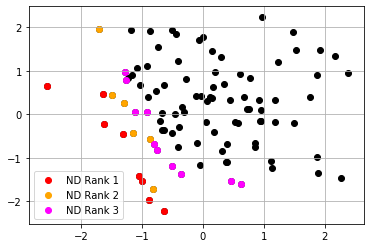
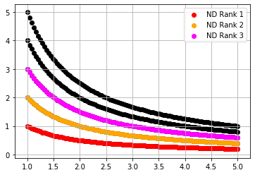

# Fast non-dominated sort library

[](https://github.com/nabenabe0928/fast-pareto)
[](https://codecov.io/gh/nabenabe0928/fast-pareto)

This library is solely for non-dominated search and to find Pareto optimal solutions.
There are only two functions (**is_pareto_front** and **nondominated_rank**) in this library and we describe the usage below.
The time complexity of finding the Pareto solutions is $O(N (\log N)^{M - 2})$ for $M > 3$ and $O(N\log N)$ for $M = 2, 3$ where $N$ is `n_observations` and $M$ is `n_objectives`. (Kung's algorithm)

> [!NOTE]
> There is a package for 2d costs ([pygmo](https://esa.github.io/pygmo2/)), but this package does not support 3d or higher dimensional costs.


## Setup

```shell
$ pip install fast-pareto
```

## Examples

```python
from fast_pareto import is_pareto_front, nondominated_rank
import numpy as np


is_pareto_front(np.array([[0, 1], [1, 0], [1, 1]]))
>>> array([True, True, False])

is_pareto_front(np.array([[0, -1], [1, 0], [1, -1]]), larger_is_better_objectives=[1])
>>> array([True, True, False])

nondominated_rank(np.array([[2], [1], [0]]))
>>> array([2, 1, 0], dtype=int32)

nondominated_rank(np.array([[2], [1], [0]]), larger_is_better_objectives=[0])
>>> array([0, 1, 2], dtype=int32)
```

## is_pareto_front

This function determines the Pareto front from a provided set of costs.
The arguments are a numpy array with the shape of `(n_observations, n_objectives)` and a list of indices that show which objectives are "larger is better".
If `None` is provided, we consider all objectives should be minimized.
This function returns the true/false mask with the shape of `(n_observations, )`.
True means the corresponding observation is on the Pareto front given a set of solutions.

> [!NOTE]
> For 2d costs, we provide `is_pareto_front2d`, which is much quicker.
> We need exactly the same arguments as `is_pareto_front` and users can optionally specify `ordered=True` to further speed up.

## nondominated_rank

This function calculates the non-dominated rank of each observation.
The arguments are a numpy array with the shape of `(n_observations, n_objectives)` and a list of indices that show which objectives are "larger is better".
If `None` is provided, we consider all objectives should be minimized.
This function returns the non-dominated rank with the shape of `(n_observations, )`.
The non-dominated rank is better when it is smaller.
For this implementation, we return zero when those observations are on the Pareto front.

You can see the examples of [the results obtained by this module](example/example_visualizations.ipynb) below.
<table>
    <tr>
        <td></td>
        <td></td>
    </tr>
</table>

Note that we added the tie-breaking feature using average ranks in v0.0.5
and when you specify `tie_break=True`, this function returns the ranks of each observation
with tie-breaking.
For example, when we have non-domination ranks of `[0, 0, 1, 1]` with `tie_break=False`,
then `tie_break=True` tries to differentiate those values to be such as `[1, 0, 2, 3]`.
When using this feature, we will not get non-domination ranks anymore,
but if the rank for the i-th observation `r[i]` and that for the j-th observation `r[j]`
have the relationship of `r[i] < r[j]`, it is guaranteed that the non-domination rank
of the i-th observation is lower or equal to that of the j-th observation.

## Benchmarking
### Test code

```python
for n_points in [100, 1000, 10000]:
    for n_costs in [1, 5, 10, 50]:
        print(f"n_points={n_points}, n_costs={n_costs}")
        %time nondominated_rank(np.random.normal(size=(n_points, n_costs)))
        print("\n")
```

## Results

```shell
n_points=100, n_costs=1
CPU times: user 13.4 ms, sys: 897 µs, total: 14.3 ms
Wall time: 14.3 ms

n_points=100, n_costs=5
CPU times: user 3.41 ms, sys: 0 ns, total: 3.41 ms
Wall time: 3.42 ms


n_points=100, n_costs=10
CPU times: user 2.86 ms, sys: 0 ns, total: 2.86 ms
Wall time: 2.87 ms


n_points=100, n_costs=50
CPU times: user 4.55 ms, sys: 0 ns, total: 4.55 ms
Wall time: 4.56 ms


n_points=1000, n_costs=1
CPU times: user 190 ms, sys: 0 ns, total: 190 ms
Wall time: 190 ms


n_points=1000, n_costs=5
CPU times: user 45.4 ms, sys: 0 ns, total: 45.4 ms
Wall time: 45.4 ms


n_points=1000, n_costs=10
CPU times: user 68.6 ms, sys: 0 ns, total: 68.6 ms
Wall time: 68.7 ms


n_points=1000, n_costs=50
CPU times: user 116 ms, sys: 0 ns, total: 116 ms
Wall time: 116 ms


n_points=10000, n_costs=1
CPU times: user 5.16 s, sys: 0 ns, total: 5.16 s
Wall time: 5.17 s


n_points=10000, n_costs=5
CPU times: user 2.18 s, sys: 2.16 ms, total: 2.19 s
Wall time: 2.19 s

n_points=10000, n_costs=10
CPU times: user 4.42 s, sys: 0 ns, total: 4.42 s
Wall time: 4.42 s


n_points=10000, n_costs=50
CPU times: user 15.7 s, sys: 7.47 ms, total: 15.7 s
Wall time: 15.7 s
```

## Appendix

To supplement the knowledge, I note the definition of non-dominated rank.
Suppose we would like to minimize the multiobjective function $f: \mathbb{R}^D \rightarrow \mathbb{R}^M$. $f(\boldsymbol{x})$ is said to dominate $f(\boldsymbol{x}^\prime)$ if and only if $\forall i \in \\{1, \dots, M\\}, f_i(\boldsymbol{x}) \leq f_i(\boldsymbol{x}^\prime)$ and $\exists i \in \\{1, \dots, M\\}, f_i(\boldsymbol{x}) < f_i(\boldsymbol{x}^\prime)$.

When there is no such observation that dominates $f(\boldsymbol{x})$, $f(\boldsymbol{x})$ is said to be Pareto optimal and the non-domination rank of $f(\boldsymbol{x})$ is defined as 1 (but in our code, we define it as zero).
Furthermore, $f(\boldsymbol{x}^\prime)$ is said to be the non-domination rank of $n$ when $f(\boldsymbol{x}^\prime)$ is the Pareto optimal in a set such that it excludes observations with the non-domination rank of $n - 1$ or lower.
